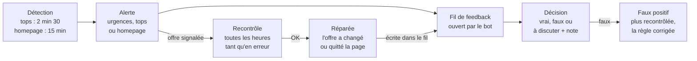

# Price check — guide de l'équipe

État au 07/10/2026. Pour l'équipe, ce guide est une page de l'admin, « 📘 Guide équipe » sur la page Price check
(`/executor/price-check-guide`), générée depuis ce fichier par `tools/guide_html.py`, et une doc partagée (Claude Docs,
onglets Français et English) : <https://claude.ai/code/artifact/2c890bc0-9b6c-42e9-b0dc-298c0e11ac84>. Les trois sont tenues à jour ensemble. English version:
[team-guide.md](team-guide.md).

## À quoi sert le price check

Le price check vérifie en continu que les premiers prix des pages produit les plus vues d'AllKeyShop vendent bien ce que la page affiche, et alerte sur Discord dès qu'une offre ne correspond pas.

- **Les pages suivies** : les tops (10 premiers Popular, 5 premiers Coming soon PC), toutes les 2 min 30 ; toute la homepage (environ 430 pages : widgets de la home et TOP 50 de chaque plateforme), toutes les 15 min.
- **Les offres contrôlées** : sur chaque page, les 3 offres de clé les moins chères de chaque édition. Ce sont les « premiers prix ».
- **Le contrôle** : le moniteur suit le lien de chaque offre jusqu'au marchand, lit l'URL (et la page si besoin), puis compare avec le produit, l'édition, la région et la plateforme affichés par AllKeyShop.

| Erreur cherchée | Exemple réel |
| --- | --- |
| Mauvais produit | Titanfall 1 vendu sur la page de Titanfall 2 (Kinguin) |
| Région plus étroite | Clé ROW affichée EUROPE (Monster Hunter Wilds, G2A) |
| Autre plateforme | Clé Microsoft Store affichée Steam (Call of Duty MW4, Instant Gaming) |
| Mauvaise édition | Complete Edition rangée en Standard (GTA 4, Steam) |
| Gift ou compte vendu comme une clé | Steam altergift affiché en clé EU (AC Black Flag Resynced, Royal CD Keys) |
| DLC ou monnaie de jeu vendus comme le jeu | COD Points sur la page du jeu |
| Rupture chez le marchand | Kinguin redirige le lien vers une autre fiche, mais le prix reste dans le feed (Stellaris) |

## Les trois salons Discord

Chaque alerte part dans un seul salon : les urgences d'abord, puis les tops, puis la homepage.

| Salon | Ce qui y arrive | Priorité |
| --- | --- | --- |
| #aks_price_emergencies | Les urgences premiers prix : un problème avéré (SUSPECT) sur l'une des 3 offres les moins chères d'une édition, que la page soit dans les tops ou dans la homepage. L'en-tête dit d'où vient l'alerte. | À traiter en premier |
| #aks_price_checker | Les autres alertes des tops (TO CHECK, à vérifier ; offres plus bas dans l'édition) et les récapitulatifs de recontrôle des tops. C'est aussi le salon du bot. | Ensuite |
| #aks_top_price_checker | Les autres alertes de la homepage et leurs récapitulatifs. | Ensuite |

Chaque boucle commence, dans chaque salon où elle poste, par un bandeau très visible : « 🔄 New loop · Price check top » (nouvelle boucle ; 🚨 dans le salon des urgences), avec l'heure, ce que la boucle contrôle, la légende des messages et le lien vers ce guide. Une boucle sans alerte ne poste rien.

Les alertes sont écrites en anglais depuis le 07/10/2026 (en français avant) ; ce guide donne leur sens.

| Début du message | Ce que c'est |
| --- | --- |
| 🔄 New loop (🚨 aux urgences) | Le bandeau : une boucle commence |
| ↪️ Loop continued | La même boucle reprend après les messages d'une autre (suite de la boucle) |
| 🚨 FIRST PRICE EMERGENCY, 🔴 SUSPECT, 🟠 TO CHECK | Un nouveau report (urgence premier prix, suspect, à vérifier) |
| 📌 Reminder · existing report | Un ancien report renvoyé dans son bon salon (rappel) : pas une nouvelle détection |
| 📌 Reminder · still wrong after being handled | Une offre déjà tranchée « vrai », toujours en erreur au recontrôle : la correction n'a pas pris |
| 🔁 Re-check | Le bilan du recontrôle : réparées, toujours en erreur, nouvelles erreurs |
| 📋 Morning reminder | Chaque jour à 9 h, aux urgences (rappel du matin) : les premiers prix encore en erreur et le bilan des dernières 24 h |

## Lire une alerte

Une alerte dit quelle offre est en cause, où elle s'affiche, et pourquoi le moniteur la croit fausse. Exemple, dans #aks_price_emergencies :

```
🚨 FIRST PRICE EMERGENCY · Price check homepage
📌 Reminder · existing report (flagged on 2026-10-01 14:58), sent again to the first price emergency channel
🔴 SUSPECT · Monster Hunter Wilds (Home · RPG #8) · Deluxe · 2nd price of the edition
G2A · EUROPE (STEAM EU) · steam · 44.10 € · offer 136209040 · check: URL
Reason: region: AllKeyShop EUROPE, merchant ROW
Merchant: <lien de l'offre chez G2A>
Page: <lien de la page AllKeyShop>
```

| Ligne | Ce qu'elle dit |
| --- | --- |
| FIRST PRICE EMERGENCY | Urgence premier prix : un problème avéré sur l'un des 3 premiers prix de l'édition, et le mode qui l'a trouvé (top ou homepage) |
| Reminder · existing report | Une ancienne alerte (rappel · report existant), renvoyée une seule fois dans son bon salon (absente d'une alerte neuve) |
| Verdict · jeu (liste #rang) · édition · rang | Le verdict, la page, la liste où elle figure, l'édition où l'offre est rangée et son rang dans cette édition (« 2nd price of the edition » = 2e prix de l'édition) |
| Marchand · région · plateforme · prix | Ce qu'affiche AllKeyShop : la région avec son nom de filtre entre parenthèses (le vrai sens de la région), le prix frais carte compris, l'id de l'offre (offer), et comment le moniteur a contrôlé (check : URL, page) |
| Reason | Ce qui ne va pas (raison) : ici, AllKeyShop affiche une clé EUROPE, le marchand vend une clé ROW (reste du monde, sans l'Europe) |
| Note | Quand il y en a une : ce que la page du marchand a confirmé ou contredit |
| Merchant, Page | Les deux liens pour vérifier : offre chez le marchand, page AllKeyShop |

Les verdicts :

- **SUSPECT** : un problème est trouvé, l'alerte part.
- **TO CHECK** (à vérifier) : impossible de conclure (page du marchand illisible), sur le premier prix d'une page des tops ou d'un coming soon. Un humain vérifie.
- **SUSPECT, « abnormally low first price: … % of the page's second price »** (premier prix anormalement bas) : l'offre la moins chère de la page coûte moins de 70 % de la suivante (Transport Fever 3 : une clé « mystère » à 2,96 € contre 33 €). Une urgence, même quand l'URL semble correcte : vérifier que le marchand vend bien ce jeu, cette édition, cette région ; un vrai bon prix se tranche Faux positif.
- **TO CHECK, « in doubt: region … »** (en doute : région) : chez G2A, une clé ROW affichée EUROPE. Le « row » de G2A ne dit pas quels pays la clé couvre : lire les pays d'activation sur la page G2A ; l'Europe est couverte : Faux positif.
- **TO CHECK, « in doubt: extra words after the name »** (en doute : mots en plus après le nom) : l'URL de l'offre ajoute après le nom du jeu des mots que le moniteur ne connaît pas (Minecraft ← « minecraft-dungeons-2 », Control ← « control-resonant ») : un autre jeu, ou un simple sous-titre ? Quel que soit le rang de l'offre, une seule alerte par page et par mots ; la décision vaut pour toutes les offres de la page qui ont ces mots, et un « faux » pour toutes les pages du jeu (PC, Xbox, PS5).
- **UNVERIFIABLE** (non vérifiable) : le même cas ailleurs. Noté dans l'admin, sans alerte.

Les messages « Re-check … » (recontrôle) sont des bilans : offres toujours en erreur, réparées, faux positifs levés par une règle.

## Donner son feedback dans le fil de l'alerte

Chaque alerte a son fil « Feedback · jeu · offer id » : on y tranche en une ligne, et la décision arrive aussitôt dans l'admin.

1. Ouvrir le fil sous l'alerte.
2. Répondre en commençant par l'un de ces mots (les mots anglais marchent aussi : `true`, `false`, `discuss`) :
    - `vrai` (ou `vp`, ✅) : l'erreur est réelle.
    - `faux` (ou `fp`, ❌) : l'offre est correcte, l'alerte n'aurait pas dû partir.
    - `à discuter` (ou 💬) : on en parle avant de trancher.
3. Seulement si besoin, ajouter après le mot une note qui dit pourquoi, par exemple `faux : la page AllKeyShop est bien un DLC`. D'accord avec l'erreur décrite sur le report : `vrai` suffit, il n'y a rien à commenter.
4. Le bot confirme dans le fil, en anglais : « Decision saved: False positive — by … » (décision enregistrée).

- **Qui peut trancher** : les personnes autorisées sur le bot. Romain les ajoute avec `!allow @nom` dans #aks_price_checker. Les autres reçoivent un rappel, et leur message reste dans le fil.
- **Discuter sans trancher** : un message qui ne commence pas par l'un de ces mots ne décide rien.
- **Ce que fait un « faux »** : l'offre n'est plus recontrôlée ni alertée. La note sert à corriger les règles du moniteur, pour tous les marchands. Sur une alerte « in doubt: extra words » (en doute : mots en plus), un « faux » apprend ces mots pour le jeu, sur toutes ses plateformes (un sous-titre, par exemple) : les autres offres qui les ont passent.
- **Ce que fait un « à discuter »** : l'offre attend la discussion. Elle n'est pas reportée de nouveau : elle passe en tête de l'admin, dans la partie « 💬 À discuter », avec la note comme commentaire, et reste dans le rappel du matin jusqu'à la décision finale (vrai ou faux). Pour clore, on tranche sur l'offre, pas sur le commentaire : `vrai` si l'erreur est réelle, `faux` si l'offre est correcte. D'accord avec un commentaire qui montre que l'offre est juste : c'est `faux`.
- **Ce que fait un « vrai »** : l'offre reste recontrôlée toutes les heures. Toujours en erreur au moins un quart d'heure après la décision, elle repart, puis à chaque recontrôle qui la voit encore en erreur (au plus une fois par heure), avec « 📌 Reminder · still wrong after being handled by … » (toujours en erreur après traitement) : trancher ne suffit pas, il faut que l'offre soit corrigée. Corrigée mais encore signalée ? L'URL de l'offre reste 24 h en cache sur AllKeyShop : vider ce cache. Sur une alerte « in doubt: extra words », un « vrai » en fait une erreur pour toutes les offres de la page qui ont ces mots.
- **Ce que le fil reçoit ensuite** : les suites de l'offre (réparée, faux positif levé par une règle, de nouveau en erreur) et les décisions prises dans l'admin.

## Que faire face à une alerte

Vérifier sur les deux pages, trancher dans le fil, puis faire corriger l'offre si l'erreur est réelle.

1. **Les urgences d'abord** (#aks_price_emergencies) : un premier prix faux, c'est ce que voient les visiteurs.
2. **Sur la page AllKeyShop** (lien « Page ») : l'édition où l'offre est rangée, les autres éditions de la page, le nom de filtre de la région (STEAM EU, STEAM GLOBAL, XBOX X|S EUROPE…), la plateforme.
3. **Chez le marchand** (lien « Merchant ») : le produit, l'édition, la région et la plateforme réellement vendus.
4. **Trancher dans le fil** : vrai, faux ou à discuter. D'accord avec l'erreur décrite : pas de note ; sinon, une note qui dit pourquoi.
5. **Si c'est vrai** : faire corriger l'offre sur AllKeyShop (édition, région, plateforme, rattachement à la page) ou la faire retirer ; pour une rupture chez Kinguin, c'est au marchand de sortir l'offre de son feed. Au recontrôle suivant (moins d'une heure), le moniteur classe l'offre « réparée » et l'écrit dans le fil. Si elle est encore en erreur, l'alerte revient à chaque recontrôle (au plus une fois par heure), avec « 📌 Reminder · still wrong after being handled by … » : la correction n'a pas pris, ou l'ancienne URL est encore dans le cache d'AllKeyShop (24 h) : le vider.

Ce qui n'est pas une erreur :

- une clé GLOBAL affichée EUROPE : le marchand vend plus large que ce qui est affiché ;
- une clé activable en Europe et aux États-Unis affichée GLOBAL : elle compte comme GLOBAL (règle de traitement des régions, 05/10/2026) ;
- une restriction de langue (IN ENGLISH ONLY, EN/FR) : ce n'est pas une région ;
- la zone d'un gift : elle n'est pas comparée.

## L'admin Price check

L'admin montre tous les reports au même endroit, avec les mêmes décisions que les fils Discord : <https://169.58.5.63.sslip.io/executor/price-check> (identifiant de l'admin).

- **Une carte par report** : le verdict, « ✔ Traité par <opérateur> » (ou « À traiter », ou « 💬 À discuter »), les pastilles TOP ou HOMEPAGE (d'où vient le problème) et PREMIER PRIX (l'une des 3 offres les moins chères de l'édition), le jeu, l'édition, le rang, le marchand, le prix, la raison, et trois liens : page AllKeyShop, offre chez le marchand, fil Discord.
- **Deux onglets** : **« En cours »**, ce qui reste à faire (à traiter, à discuter, à corriger), et **« Archives »**, les reports réglés : réparés, faux positifs levés par une règle, vérifiés OK, faux positifs jugés. Un **vrai positif** dont l'offre n'a pas encore changé reste en cours, marqué « 🔧 À corriger » : l'erreur est confirmée, il reste à la faire corriger sur AllKeyShop ; il passe dans les archives quand le recontrôle la voit réparée. Mis « À discuter », un report archivé revient en cours, en tête. Un lien vers un report (rappel du matin, Discord) ouvre l'onglet où il se trouve.
- **Trois parties dans « En cours »** (les archives gardent les tops et la homepage) : en tête, **« 💬 À discuter »** (titre orange) : les reports mis à discuter, avec le commentaire de celui qui les y a mis, jusqu'à la décision finale (Vrai positif ou Faux positif, qui l'archive). Sur ces cartes, le sens des boutons est écrit en clair : « Vrai positif : l'erreur est réelle », « Faux positif : l'offre est correcte ». Elle s'affiche toujours : un report à discuter que les filtres cachent y est compté (« 1 masqué par les filtres »). Puis les reports des tops (titre « Price check top », bande et badge TOP en bleu) : un report trouvé sur une page des tops y reste jusqu'à sa décision quand la page sort des tops, marqué « sortie des tops le … ». Puis ceux de la homepage ; une partie vide le dit (« Aucun report à discuter », « Aucun report sur les tops »). Le filtre « Mode » ne garde que les tops ou la homepage.
- **Trancher** : chaque carte se lit en deux étapes, ① Pourquoi ? (la note, seulement si besoin) à gauche et ② Ta décision (Vrai positif, Faux positif, À discuter) à droite. D'accord avec l'erreur décrite sur le report : clique Vrai positif, sans note, il n'y a rien à commenter. Sinon, écris la note puis clique ta décision : les deux partent ensemble ; une note modifiée après coup s'enregistre avec « Mettre à jour la note » (ou Entrée), et une note pas encore enregistrée est signalée en orange. Un encadré « Comment trancher un report » le rappelle en haut de la liste. Un report tranché reste quelques secondes à sa place, bordé de vert (« ✔ Décision enregistrée »), puis passe dans les archives ou dans sa nouvelle partie, ou s'efface s'il ne correspond plus aux filtres (le bandeau dit où il va) : la carte suivante ne glisse pas sous le curseur. Même effet qu'une réponse dans le fil ; une décision prise sur Discord s'affiche signée « (Discord) ».
- **Filtres** : verdict (dont Réparées, Faux positifs levés par une règle, Vérifiées OK), mode (Price check top ou homepage), décision, « Traité par » (un opérateur, ou personne : à traiter), recherche libre, « encore en tête seulement », « premiers prix seulement ».
- **Compteurs** : en haut de la liste, puis le nombre de reports traités par chaque opérateur ; le détail est juste dessous.
- **Lancer un passage** : les boutons « Lancer le price check top » et « Lancer le price check homepage » recontrôlent tout de suite toutes les offres de leurs pages. Compter quelques minutes pour les tops, environ 2 h 30 pour la homepage.
- **Concurrents** (au-dessus des reports) : un widget par concurrent (gg.deals, dlcompare.fr, gocdkeys.fr), pour les pages des tops, relevé toutes les 30 min. **Clé contre clé, compte contre compte, jamais mélangés** : la clé AllKeyShop la moins chère, frais de carte compris (le premier prix que montre la page), face à la meilleure clé du concurrent ; les comptes dans une deuxième table, quand le concurrent en vend (gocdkeys). Le prix du concurrent est **en vert** si AllKeyShop est moins cher, **en orange** au même prix, **en rouge** si le concurrent est moins cher, et juste à côté le premier prix AKS. « Introuvable » : le jeu n'a pas été trouvé chez ce concurrent. Les pages console (EA SPORTS FC 27 PS5) ne sont pas comparées : les concurrents n'y donnent pas de prix par console. gg.deals passe par son API officielle (les jeux absents de Steam, comme Minecraft, y sont introuvables) ; tant qu'elle refuse la clé, son widget dit « bloqué » et pourquoi.
- **Fee / error** : sur une ligne où le concurrent est moins cher, mets son offre dans ton panier. S'il y a des frais, ou si le prix affiché est faux, écris le montant dans la case, en euros, en plus ou en moins (« 1,50 », « -0,80 »), puis Entrée : il compte pour ce marchand ; si son offre devient plus chère, l'offre suivante du concurrent prend sa place tout de suite, en vert, orange ou rouge face à AllKeyShop. Case vide : la saisie est effacée. C'est pour le suivi seulement, le moniteur ne s'en sert pas.
- **Console · Claude** (Romain, Rémy, Garance et Lionel) : pose tes questions à Claude sur une alerte, un report, une règle (« pourquoi Minecraft Deluxe Collection est sorti en urgence ? »). Entrée envoie, Maj+Entrée va à la ligne. Claude répond, mais ne modifie rien pour toi : les modifications passent par Romain. Quand une question demande sa décision, Claude l'envoie dans l'onglet Romain (« → Q13 : question pour Romain »). Tout le monde voit toute la conversation. Romain a en plus « Récolter les décisions » (Claude relit les décisions et propose une action pour chacune) et « Nouvelle session ».
- **Onglet Romain** : toutes les questions en cours pour Romain (posées dans la console ou issues de la récolte des décisions) et les reports « à discuter ». Tout le monde le consulte ; seul Romain règle une question, avec sa réponse, qui part à Claude.
- **English / Français** : l'admin s'ouvre en anglais (depuis le 07/10/2026). Le bouton FR en haut des onglets Price check et Romain passe l'interface en français (EN revient à l'anglais), choix gardé par ton navigateur. Le moniteur écrit ses raisons en anglais depuis le 07/10/2026 (celles d'avant, en français, sont traduites dans l'interface anglaise) ; les notes et les réponses de Claude restent dans leur langue.

### Les compteurs

Chaque report a **un seul état**, et les compteurs en sont la somme : rien n'est compté deux fois. Les quatre premiers et les deux suivants disent ce qui reste à faire (onglet « En cours ») ; les quatre derniers, ce qui est réglé (onglet « Archives »).

| Compteur | Ce qu'il compte |
| --- | --- |
| à traiter | Reports sans décision, pas réparés : à trancher (Vrai positif, Faux positif ou À discuter) |
| à discuter | Reports mis « À discuter », en attente de la décision finale ; encadré orange tant qu'il en reste |
| à corriger | Vrais positifs dont l'offre n'a pas encore changé : l'erreur est confirmée, il faut la faire corriger sur AllKeyShop |
| premiers prix en erreur | Parmi les reports en cours (à traiter, à discuter, à corriger), les SUSPECT sur l'un des 3 premiers prix de leur édition : ce que voient les visiteurs, la priorité. Même définition que le rappel du matin |
| tops à trancher, homepage à trancher | Les reports « à traiter », partagés entre les tops et la homepage |
| réparées | L'offre a changé (URL, région, plateforme, édition) ou a quitté sa page : le recontrôle l'a trouvée OK |
| faux positifs levés | Rien n'a changé dans l'offre, mais une règle ajoutée depuis la blanchit : l'alerte était un faux positif |
| vérifiées OK | L'offre n'avait pas pu être vérifiée (page illisible), un recontrôle l'a vérifiée OK |
| faux positifs jugés | Reports tranchés « Faux positif » : l'offre est correcte, elle n'est plus recontrôlée |
| reports | Le total : en cours + archives |

En cours = à traiter + à discuter + à corriger ; archives = réparées + faux positifs levés + vérifiées OK + faux positifs jugés. Le 06/10/2026, par exemple : 69 reports = 7 en cours (0 à traiter, 0 à discuter, 7 à corriger, dont 4 premiers prix en erreur : The Witcher 3 chez Instant Gaming, Warhammer 40k Space Marine 2 et GTA 4 chez Steam, The Blood of Dawnwalker chez Eneba) + 62 en archives (27 réparées, 8 faux positifs levés, 6 vérifiées OK, 21 faux positifs jugés).

Le verdict du moniteur (SUSPECT, À VÉRIFIER, NON VÉRIFIABLE ; TO CHECK et UNVERIFIABLE en anglais) se lit sur chaque carte et se filtre (« Verdict ») ; il n'a plus son compteur, car il mélangeait les états : un SUSPECT jugé faux positif restait compté comme SUSPECT.

## Ce que le moniteur fait tout seul

Une offre signalée est recontrôlée toutes les heures jusqu'à sa réparation, et chaque suite s'écrit dans son fil.



| Résultat du recontrôle | Ce que ça veut dire |
| --- | --- |
| Réparée | L'offre a changé (URL, région, plateforme, édition) ou a quitté la page |
| Faux positif levé par une règle | Rien n'a changé : une règle ajoutée depuis la blanchit |
| Vérifiée OK | Elle n'avait pas pu être vérifiée, elle l'est maintenant |
| Toujours en erreur | Rien n'a bougé : recontrôlée l'heure suivante |
| Toujours en erreur après une décision « vrai » | Reportée de nouveau, au moins 15 min après la décision, puis à chaque recontrôle tant qu'elle est en erreur (au plus une fois par heure) : « 📌 Reminder · still wrong after being handled by … » |
| De nouveau en erreur | Une offre OK devenue fausse : nouvelle alerte |

Une offre jugée faux positif n'est plus recontrôlée. Les boutons de l'admin lancent un recontrôle complet sans attendre l'heure.

**Le rappel du matin** : chaque jour à 9 h, #aks_price_emergencies reçoit « 📋 Morning reminder · first price emergencies » (rappel du matin). Il liste les premiers prix encore en erreur (même tranchés « vrai » ou « à discuter »), les plus anciens d'abord, avec leur ancienneté, leur statut (à traiter, ou la décision et qui l'a prise) et le lien de leur carte dans l'admin. Suit le bilan des dernières 24 h : nouveaux reports, réparés, faux positifs levés par une règle, décisions par opérateur.

## Cas déjà jugés, pour se caler

Ces décisions font jurisprudence : le moniteur a déjà été corrigé pour les faux positifs, et il alerte toujours sur les vraies erreurs. Le registre complet est dans [precedents.md](precedents.md).

| Cas | Décision | Pourquoi |
| --- | --- | --- |
| Titanfall 2 Deluxe, Kinguin vend le premier Titanfall | Vrai positif | Un autre jeu de la série n'est jamais le jeu |
| Monster Hunter Wilds Deluxe, G2A vend une clé ROW affichée EUROPE | Faux positif | Rémy a vérifié : la clé s'active en Europe, seuls les États-Unis sont exclus. Chez G2A, une clé ROW affichée EUROPE part désormais « à vérifier » : regarder les pays d'activation sur la page G2A |
| Minecraft, « Java & Bedrock Edition Deluxe Collection » (G2A, Eneba, Driffle) rangée en Deluxe Collection Edition | Faux positif | Le nom complet du produit contient l'édition principale de la page (Java & Bedrock Edition) ; l'édition Deluxe Collection est bien nommée |
| Escape from Tarkov, la boutique de l'éditeur (escapefromtarkov.com) ne nomme pas le jeu dans son lien | Faux positif | Cette boutique ne vend que ce jeu |
| GTA 4, la Complete Edition de Steam rangée en Standard | Vrai positif | Mauvaise édition, même si l'acheteur reçoit plus : la page a une édition Complete |
| STAR WARS Zero Company Xbox, une Deluxe rangée en « Standard + DLC » | Vrai positif | La page a une édition Deluxe |
| Stellaris Bundle 1, Kinguin redirige le lien vers une autre fiche | Rupture à signaler | La fiche du lien est en rupture, le prix reste dans le feed |
| Pokémon Scarlet, DLC « The Hidden Treasure of Area Zero », GameBoost vend la version Violet | Faux positif | Cette page couvre le DLC des deux versions ; cas propre à Pokémon, sans généralisation |
| Minecraft Dungeons Triple Bundle, CJS CDKeys « région Argentine » | Faux positif | Le lien choisit la variante Europe ; la page montre l'Argentine par défaut |
| Mario Kart World, K4G vend une clé GLOBAL affichée EUROPE | Faux positif | Le marchand vend plus large que l'affichage |
| Dying Light The Beast, GameBoost vend une clé « ROW » activable partout sauf au Japon, affichée GLOBAL | Faux positif | Une clé activable en Europe et aux États-Unis compte comme GLOBAL (décision de Rémy, validée par Romain) |
| EA SPORTS FC 27, Mmoga « IN ENGLISH ONLY » | Faux positif | Une langue n'est pas une région |
| Farming Simulator 25 Year 1 Edition, Loaded vend le Year 1 Season Pass | Faux positif | Le jeu est inclus dans ce pass |

## Questions fréquentes et contacts

- **Le bot ne prend pas ma décision.** Il faut être autorisé : demander à Romain un `!allow @vous`. Vérifier aussi que le message commence par `vrai`, `faux`, `à discuter` (ou `true`, `false`, `discuss`) ou l'un des emoji ✅ ❌ 💬.
- **Je ne sais pas trancher.** Répondre `à discuter`, avec ce que vous voyez sur les deux pages.
- **L'offre a été corrigée.** Rien à faire : le recontrôle horaire la classe « réparée » et l'écrit dans son fil.
- **Une alerte revient alors qu'elle était réglée.** L'offre est redevenue fausse (nouvelle saisie, fiche du marchand changée) : c'est une nouvelle alerte, à trancher comme les autres.
- **Je veux vérifier une offre tout de suite.** Le bouton « Lancer le price check top » de l'admin recontrôle les tops en quelques minutes.
- **Parler au bot.** Dans #aks_price_checker, en le mentionnant (personnes autorisées seulement) ; `!help` donne les commandes. Attention : une personne autorisée a aussi accès à Claude sur le serveur du moniteur.
- **Contact** : Romain, pour les droits, les règles et tout cas qui ne rentre dans aucune case.
