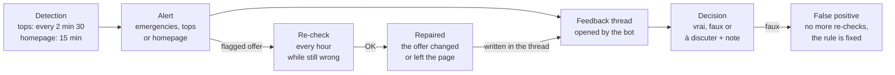

# Price check — team guide

As of 03/10/2026. For the team, this guide is a page of the admin, "📘 Guide équipe" on the Price check page
(`/executor/price-check-guide`), generated from this file by `tools/guide_html.py`, and a shared doc (Claude Docs,
Français and English tabs): <https://claude.ai/code/artifact/2c890bc0-9b6c-42e9-b0dc-298c0e11ac84>. All three are kept in step. Version française :
[guide-equipe.md](guide-equipe.md).

## What price check is for

Price check keeps checking that the first prices on AllKeyShop's most viewed product pages sell what the page shows, and alerts on Discord as soon as an offer does not match.

- **Pages watched**: the tops (first 10 Popular, first 5 Coming soon PC), every 2 min 30; the whole homepage (about 430 pages: home widgets and the TOP 50 of each platform), every 15 min.
- **Offers checked**: on each page, the 3 cheapest key offers of every edition. These are the "first prices".
- **How**: the monitor follows each offer's link to the merchant, reads the URL (and the page when needed), then compares it with the product, edition, region and platform AllKeyShop shows.

| Error looked for | Real example |
| --- | --- |
| Wrong product | Titanfall 1 sold on the Titanfall 2 page (Kinguin) |
| Narrower region | ROW key shown EUROPE (Monster Hunter Wilds, G2A) |
| Other platform | Microsoft Store key shown Steam (Call of Duty MW4, Instant Gaming) |
| Wrong edition | Complete Edition filed under Standard (GTA 4, Steam) |
| Gift or account sold as a key | Steam altergift shown as an EU key (AC Black Flag Resynced, Royal CD Keys) |
| DLC or in-game currency sold as the game | COD Points on the game's page |
| Out of stock at the merchant | Kinguin redirects the link to another listing, but the price stays in the feed (Stellaris) |

## The three Discord channels

Each alert goes to one channel only: emergencies first, then the tops, then the homepage.

| Channel | What lands there | Priority |
| --- | --- | --- |
| #aks_price_emergencies | First-price emergencies: a confirmed problem (SUSPECT) on one of the 3 cheapest offers of an edition, whether the page is in the tops or the homepage. The header says where the alert comes from. | Handle first |
| #aks_price_checker | The other top alerts (À VÉRIFIER, offers lower in the edition) and the tops' re-check recaps. It is also the bot's channel. | Next |
| #aks_top_price_checker | The other homepage alerts and their recaps. | Next |

Each loop starts, in every channel it posts to, with a very visible banner: "🔄 Nouvelle boucle · Price check top" (new loop; 🚨 in the emergencies channel), with the time, what the loop checks, the legend of the messages and the link to this guide. A loop with no alert posts nothing.

| Message starts with | What it is |
| --- | --- |
| 🔄 Nouvelle boucle (🚨 in emergencies) | The banner: a loop starts |
| ↪️ Suite de la boucle | The same loop resumes after another loop's messages |
| 🚨 URGENCE PREMIER PRIX, 🔴 SUSPECT, 🟠 À VÉRIFIER | A new report |
| 📌 Rappel · report existant | An older report sent again to its right channel (reminder): not a new detection |
| 📌 Rappel · toujours en erreur après traitement | An offer already decided "vrai", still wrong at the re-check (still wrong after being handled): the fix did not take |
| 🔁 Recontrôle | The re-check recap: repaired, still wrong, new errors |
| 📋 Rappel du matin | Every day at 9 am, in emergencies (morning reminder): the first prices still wrong and the last 24 hours' summary |

## Reading an alert

An alert says which offer is at stake, where it shows, and why the monitor thinks it is wrong. Alerts are written in French; a real one, received in #aks_price_emergencies on 03/10:

```
🚨 URGENCE PREMIER PRIX · Price check homepage
📌 Rappel · report existant (signalé le 2026-10-01 14:58), renvoyé dans le salon des urgences premiers prix
🔴 SUSPECT · Monster Hunter Wilds (Home · RPG #8) · Deluxe · 2e prix de l'édition
G2A · EUROPE (STEAM EU) · steam · 44.10 € · offre 136209040 · contrôle : URL
Raison : région : AllKeyShop EUROPE, marchand ROW
Marchand : <link to the offer at G2A>
Page : <link to the AllKeyShop page>
```

| Line | What it says |
| --- | --- |
| URGENCE PREMIER PRIX | First-price emergency: a confirmed problem on one of the edition's 3 first prices, and the mode that found it (top or homepage) |
| Rappel · report existant | An older alert (reminder), sent once again to its right channel (absent from a new alert) |
| Verdict · game (list #rank) · edition · rank | The verdict, the page, the list it appears in, the edition the offer is filed under, and its rank in that edition ("2e prix de l'édition" = 2nd price of the edition) |
| Merchant · region · platform · price | What AllKeyShop shows: the region with its filter name in brackets (the region's real meaning), the price with card fees, the offer id, and how the monitor checked (contrôle : URL, page) |
| Raison | What is wrong (reason): here, AllKeyShop shows a EUROPE key, the merchant sells a ROW key (rest of world, without Europe) |
| Note | When present: what the merchant's page confirmed or contradicted |
| Marchand, Page | The two links to check: merchant offer, AllKeyShop page |

The verdicts:

- **SUSPECT**: a problem was found, the alert goes out.
- **À VÉRIFIER** (to check): no conclusion possible (merchant page unreadable), on the first price of a top or coming-soon page. A person checks.
- **SUSPECT, "premier prix anormalement bas : … % du deuxième prix de la page"** (first price abnormally low): the page's cheapest offer costs less than 70 % of the next one (Transport Fever 3: a "mystery" key at 2.96 € against 33 €). An emergency, even when the URL looks right: check that the merchant really sells this game, edition and region; a genuine good price is decided Faux positif.
- **À VÉRIFIER, "en doute : région …"** (in doubt: region): at G2A, a ROW key shown EUROPE. G2A's "row" does not say which countries the key covers: read the activation countries on the G2A page; Europe is covered: Faux positif.
- **À VÉRIFIER, "en doute : mots en plus après le nom"** (in doubt: extra words after the name): the offer's URL adds words after the game's name that the monitor does not know (Minecraft ← "minecraft-dungeons-2", Control ← "control-resonant"): another game, or just a subtitle? Whatever the offer's rank, a single alert per page and per words; the decision applies to every offer of the page with those words, and "faux" to every page of the game (PC, Xbox, PS5).
- **NON VÉRIFIABLE** (not verifiable): the same case elsewhere. Noted in the admin, no alert.

"Recontrôle …" messages are re-check recaps: offers still wrong, repaired, false positives cleared by a rule.

## Giving feedback in the alert's thread

Each alert has its thread "Feedback · game · offre id": you decide there in one line, and the decision shows up in the admin at once.

1. Open the thread under the alert.
2. Reply starting with one of these words (the bot reads French keywords; the emoji work in any language):
    - `vrai` (or `vp`, ✅): true positive, the error is real.
    - `faux` (or `fp`, ❌): false positive, the offer is correct and the alert should not have gone out.
    - `à discuter` (or 💬): to discuss before deciding.
3. Only if needed, add a note after the word saying why, for example `❌ the AllKeyShop page really is a DLC`. You agree with the error described on the report: `vrai` is enough, there is nothing to comment.
4. The bot confirms in the thread: "Décision enregistrée : Faux positif — par …" (decision recorded).

- **Who can decide**: the people authorised on the bot. Romain adds them with `!allow @name` in #aks_price_checker. Others get a reminder, and their message stays in the thread.
- **Discussing without deciding**: a message that does not start with one of these words decides nothing.
- **What "faux" does**: the offer is no longer re-checked or alerted. The note is used to fix the monitor's rules, for every merchant. On an "en doute : mots en plus" alert, "faux" teaches those words for the game, on all its platforms (a subtitle, for example): the other offers with them pass.
- **What "à discuter" does**: the offer waits for the discussion. It is not reported again: it moves to the top of the admin, in the "💬 À discuter" part (to discuss), with the note as its comment, and stays in the morning reminder until the final decision (vrai or faux). To close it, decide on the offer, not on the comment: `vrai` if the error is real, `faux` if the offer is correct. Agreeing with a comment that shows the offer is right means `faux`.
- **What "vrai" does**: the offer is still re-checked every hour. Still wrong at least a quarter of an hour after the decision, it goes out again, then at every re-check that still sees it wrong (at most once an hour), with "📌 Rappel · toujours en erreur après traitement par …": deciding is not enough, the offer has to be fixed. Fixed but still reported? The offer's URL stays 24 h in AllKeyShop's cache: clear that cache. On an "en doute : mots en plus" alert, "vrai" makes it an error for every offer of the page with those words.
- **What the thread gets next**: the offer's follow-ups (repaired, false positive cleared by a rule, wrong again) and the decisions taken in the admin.

## What to do with an alert

Check both pages, decide in the thread, then get the offer fixed if the error is real.

1. **Emergencies first** (#aks_price_emergencies): a wrong first price is what visitors see.
2. **On the AllKeyShop page** ("Page" link): the edition the offer is filed under, the page's other editions, the region's filter name (STEAM EU, STEAM GLOBAL, XBOX X|S EUROPE…), the platform.
3. **At the merchant** ("Marchand" link): the product, edition, region and platform actually sold.
4. **Decide in the thread**: vrai, faux or à discuter. You agree with the error described: no note; otherwise, a note saying why.
5. **If it is true**: get the offer fixed on AllKeyShop (edition, region, platform, page it is attached to) or removed; for an out-of-stock offer at Kinguin, the merchant has to take it out of its feed. At the next re-check (within the hour), the monitor marks the offer "repaired" and writes it in the thread. If it is still wrong, the alert comes back at every re-check (at most once an hour), with "📌 Rappel · toujours en erreur après traitement par …": the fix did not take, or the old URL is still in AllKeyShop's cache (24 h): clear it.

Not an error:

- a GLOBAL key shown EUROPE: the merchant sells wider than what is shown;
- a key that activates in Europe and the US, shown GLOBAL: it counts as GLOBAL (region rule, 05/10/2026);
- a language restriction (IN ENGLISH ONLY, EN/FR): it is not a region;
- a gift's zone: it is not compared.

## The Price check admin page

The admin shows every report in one place, with the same decisions as the Discord threads: <https://169.58.5.63.sslip.io/executor/price-check> (admin login).

- **One card per report**: the verdict, "✔ Traité par <operator>" (handled by; or "À traiter", to handle, or "💬 À discuter", to discuss), the TOP or HOMEPAGE badge (where the problem comes from) and PREMIER PRIX (first price: one of the edition's 3 cheapest offers), the game, edition, rank, merchant, price, reason, and three links: AllKeyShop page, merchant offer, Discord thread.
- **Two tabs**: **"En cours"** (in progress), what is left to do (to handle, to discuss, to fix), and **"Archives"**, the settled reports: repaired, false positives cleared by a rule, verified OK, false positives judged. A **true positive** whose offer has not changed yet stays in progress, marked "🔧 À corriger" (to fix): the error is confirmed, it still has to be fixed on AllKeyShop; it moves to the archives when the re-check finds it repaired. Put "À discuter", an archived report comes back in progress, at the top. A link to a report (morning reminder, Discord) opens the tab it is in.
- **Three parts in "En cours"** (the archives keep the tops and the homepage): first, **"💬 À discuter"** (to discuss, orange title): the reports put to discussion, with the comment of whoever put them there, until the final decision (Vrai positif or Faux positif, which archives it). On these cards, the buttons say what they mean: "Vrai positif : l'erreur est réelle" (the error is real), "Faux positif : l'offre est correcte" (the offer is correct). It always shows: a report to discuss hidden by the filters is counted there ("1 masqué par les filtres", 1 hidden by the filters). Then the tops' reports (title "Price check top", blue TOP band and badge): a report found on a top page stays there until it is decided when the page leaves the tops, marked "sortie des tops le …" (left the tops on …). Then the homepage's; an empty part says so ("Aucun report à discuter", "Aucun report sur les tops"). The "Mode" filter keeps only the tops or the homepage.
- **Deciding**: each card reads in two steps, ① Pourquoi ? (why: the note, only if needed) on the left and ② Ta décision (your decision: Vrai positif, Faux positif, À discuter) on the right. You agree with the error described on the report: click Vrai positif, no note, there is nothing to comment. Otherwise, write the note then click your decision: both leave together; a note changed afterwards is saved with "Mettre à jour la note" (or Enter), and a note not saved yet is flagged in orange. A "Comment trancher un report" box at the top of the list says so. A report just decided stays in place a few seconds, outlined in green ("✔ Décision enregistrée"), then moves to the archives or to its new part, or fades out if it no longer matches the filters (the banner says where it goes): the next card does not slide under the cursor. Same effect as a reply in the thread; a decision taken on Discord shows signed "(Discord)".
- **Filters**: verdict (including Réparées = repaired, Faux positifs levés par une règle = false positives cleared by a rule, Vérifiées OK = verified OK), mode (Price check top or homepage), decision, "Traité par" (one operator, or nobody: to handle), free search, "encore en tête seulement" (still leading only), "premiers prix seulement" (first prices only).
- **Counters**: at the top of the list, then the number of reports handled by each operator; the details are just below.
- **Running a pass**: the buttons "Lancer le price check top" and "Lancer le price check homepage" re-check every offer of their pages right away. Allow a few minutes for the tops, about 2 h 30 for the homepage.
- **Competitors** (above the reports): one widget per competitor (gg.deals, dlcompare.fr, gocdkeys.fr), for the top pages, checked every 30 min. For each game: the competitor's best displayed price, **in green** when AllKeyShop is cheaper, **in orange** at the same price, **in red** when the competitor is cheaper, and right beside it AllKeyShop's first price (the cheapest offer, accounts included, without payment fees). "Introuvable" (not found): the game was not found at that competitor. Console pages (EA SPORTS FC 27 PS5) are not compared: the competitors give no price per console. gg.deals goes through its official API (games not on Steam, like Minecraft, are not found there); while it refuses the key, its widget says "bloqué" (blocked) and why.

### The counters

Each report has **a single state**, and the counters add up: nothing is counted twice. The first four and the next two say what is left to do ("En cours" tab); the last four, what is settled ("Archives" tab).

| Counter | What it counts |
| --- | --- |
| à traiter (to handle) | Reports with no decision, not repaired: to decide (Vrai positif, Faux positif or À discuter) |
| à discuter (to discuss) | Reports put "À discuter", waiting for the final decision; outlined in orange while there are some |
| à corriger (to fix) | True positives whose offer has not changed yet: the error is confirmed, it has to be fixed on AllKeyShop |
| premiers prix en erreur (first prices in error) | Among the reports in progress (to handle, to discuss, to fix), the SUSPECT ones on one of their edition's 3 first prices: what visitors see, the priority. Same definition as the morning reminder |
| tops à trancher, homepage à trancher (tops / homepage to decide) | The reports "to handle", split between the tops and the homepage |
| réparées (repaired) | The offer changed (URL, region, platform, edition) or left its page: the re-check found it OK |
| faux positifs levés (false positives cleared) | Nothing changed in the offer, but a rule added since clears it: the alert was a false positive |
| vérifiées OK (verified OK) | The offer could not be verified (unreadable page), a re-check verified it OK |
| faux positifs jugés (false positives judged) | Reports decided "Faux positif": the offer is correct, it is no longer re-checked |
| reports | The total: in progress + archives |

In progress = to handle + to discuss + to fix; archives = repaired + false positives cleared + verified OK + false positives judged. On 06/10/2026, for example: 69 reports = 7 in progress (0 to handle, 0 to discuss, 7 to fix, including 4 first prices in error: The Witcher 3 at Instant Gaming, Warhammer 40k Space Marine 2 and GTA 4 at Steam, The Blood of Dawnwalker at Eneba) + 62 archived (27 repaired, 8 false positives cleared, 6 verified OK, 21 false positives judged).

The monitor's verdict (SUSPECT, À VÉRIFIER, NON VÉRIFIABLE) is shown on each card and can be filtered ("Verdict"); it no longer has its own counter, because it mixed the states: a SUSPECT judged a false positive was still counted as SUSPECT.

## What the monitor does on its own

A flagged offer is re-checked every hour until it is fixed, and each follow-up is written in its thread.



| Re-check result | What it means |
| --- | --- |
| Repaired (Réparée) | The offer changed (URL, region, platform, edition) or left the page |
| False positive cleared by a rule | Nothing changed: a rule added since clears it |
| Verified OK | It could not be verified before, now it is |
| Still wrong | Nothing moved: re-checked the next hour |
| Still wrong after a "vrai" decision | Reported again, at least 15 min after the decision, then at every re-check while it is wrong (at most once an hour): "📌 Rappel · toujours en erreur après traitement par …" |
| Wrong again | An OK offer became wrong: a new alert |

An offer decided as a false positive is no longer re-checked. The admin's buttons start a full re-check without waiting for the hour.

**The morning reminder**: every day at 9 am, #aks_price_emergencies gets "📋 Rappel du matin · urgences premiers prix". It lists the first prices still wrong (even those decided "vrai" or "à discuter"), oldest first, with their age, their status (to handle, or the decision and who took it) and the link to their card in the admin. Then the last 24 hours' summary: new reports, repaired, false positives cleared by a rule, decisions per operator.

## Cases already decided, to calibrate

These decisions set the precedent: the monitor has already been fixed for the false positives, and it still alerts on the real errors. The full register (in French) is [precedents.md](precedents.md).

| Case | Decision | Why |
| --- | --- | --- |
| Titanfall 2 Deluxe, Kinguin sells the first Titanfall | True positive | Another game of the series is never the game |
| Monster Hunter Wilds Deluxe, G2A sells a ROW key shown EUROPE | False positive | Rémy checked: the key activates in Europe, only the United States are excluded. At G2A, a ROW key shown EUROPE now goes out "to check": look at the activation countries on the G2A page |
| Minecraft, "Java & Bedrock Edition Deluxe Collection" (G2A, Eneba, Driffle) filed under Deluxe Collection Edition | False positive | The product's full name contains the page's main edition (Java & Bedrock Edition); the Deluxe Collection edition is named |
| Escape from Tarkov, the publisher's shop (escapefromtarkov.com) does not name the game in its link | False positive | This shop only sells this game |
| GTA 4, Steam's Complete Edition filed under Standard | True positive | Wrong edition, even if the buyer gets more: the page has a Complete edition |
| STAR WARS Zero Company Xbox, a Deluxe filed under "Standard + DLC" | True positive | The page has a Deluxe edition |
| Stellaris Bundle 1, Kinguin redirects the link to another listing | Out of stock, to report | The link's listing is out of stock, the price stays in the feed |
| Pokémon Scarlet, DLC "The Hidden Treasure of Area Zero", GameBoost sells the Violet version | False positive | This page covers the DLC of both versions; specific to Pokémon, not generalised |
| Minecraft Dungeons Triple Bundle, CJS CDKeys "Argentina region" | False positive | The link picks the Europe variant; the page shows Argentina by default |
| Mario Kart World, K4G sells a GLOBAL key shown EUROPE | False positive | The merchant sells wider than what is shown |
| Dying Light The Beast, GameBoost sells a "ROW" key that activates everywhere but Japan, shown GLOBAL | False positive | A key that activates in Europe and the US counts as GLOBAL (Rémy's decision, approved by Romain) |
| EA SPORTS FC 27, Mmoga "IN ENGLISH ONLY" | False positive | A language is not a region |
| Farming Simulator 25 Year 1 Edition, Loaded sells the Year 1 Season Pass | False positive | The game is included in that pass |

## FAQ and contacts

- **The bot does not take my decision.** You need to be authorised: ask Romain for a `!allow @you`. Also check that the message starts with `vrai`, `faux`, `à discuter` or one of the emoji ✅ ❌ 💬.
- **I cannot decide.** Reply `à discuter` (or 💬) with what you see on both pages.
- **The offer has been fixed.** Nothing to do: the hourly re-check marks it "repaired" and writes it in its thread.
- **An alert comes back after being settled.** The offer became wrong again (new entry, merchant listing changed): it is a new alert, to decide like the others.
- **I want to check an offer right now.** The admin's "Lancer le price check top" button re-checks the tops in a few minutes.
- **Talking to the bot.** In #aks_price_checker, by mentioning it (authorised people only); `!help` lists the commands. Note: an authorised person also gets access to Claude on the monitor's server.
- **Contact**: Romain, for access, rules and any case that fits none of the above.
